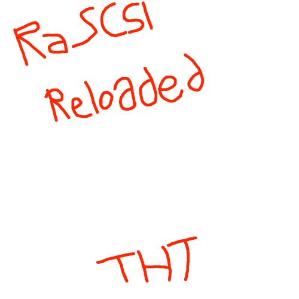
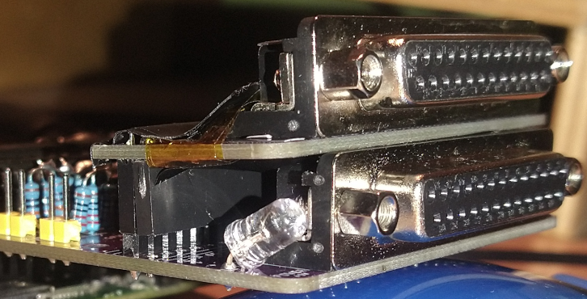
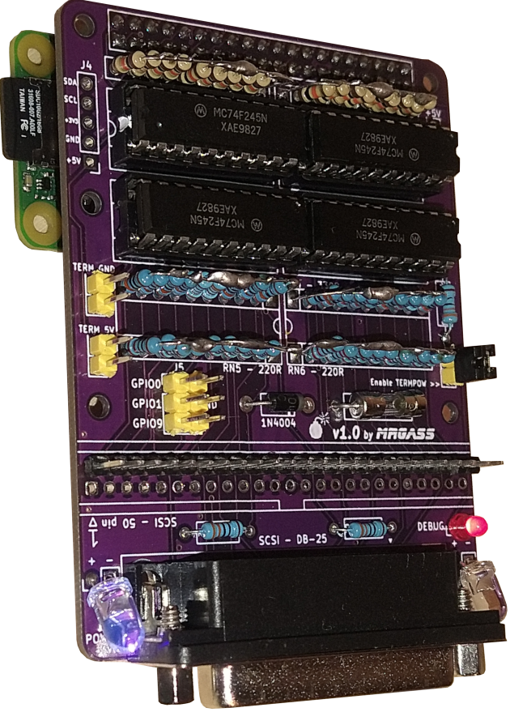
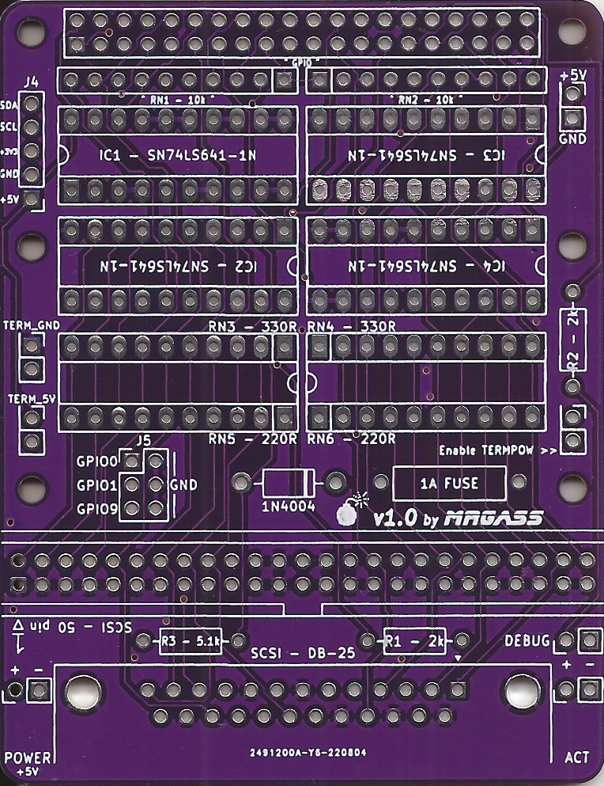
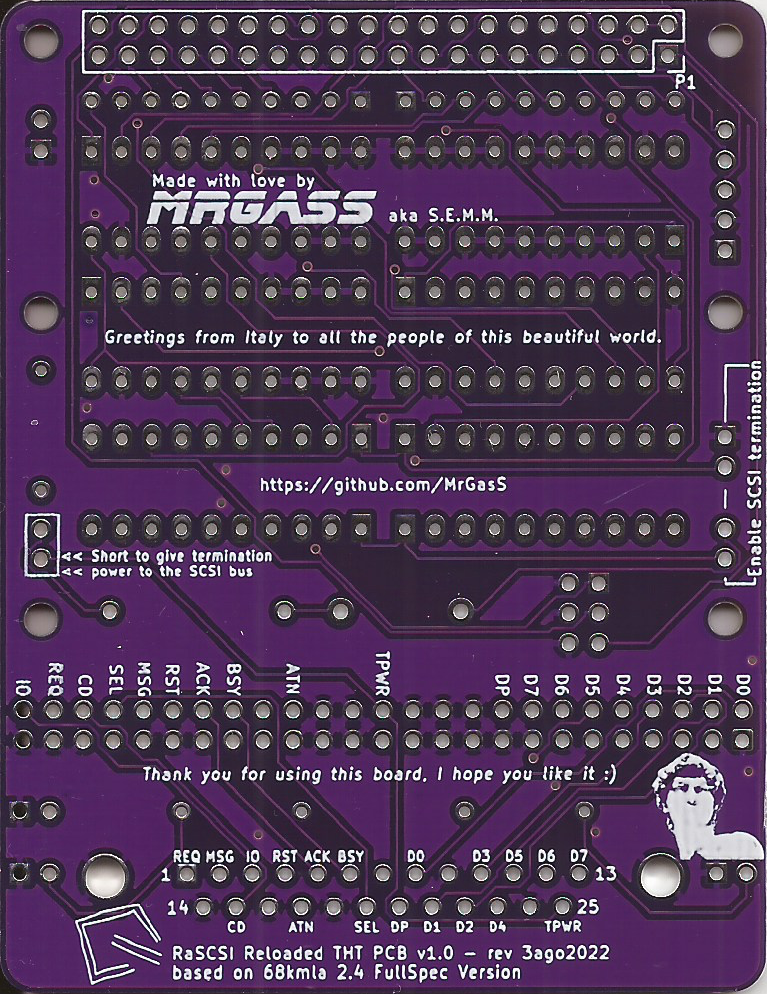

# **RaSCSI Reloaded THT PCB by MrGasS aka S.E.M.M.**  
  

RaSCSI Reloaded THT is a PCB based on original RaSCSI Reloaded's schematics and board, this PCB aims to be cheap to make and DIY friendly, especially for those who have bad SMD soldering skills (not me, hehe).  
  
I made this PCB for personal use, but I like to share it :)  
  
This PCB gives you a typical 50 pin port for internal or external case use and a DB-25 port for external use.  
  
I'm not absolutely responsible if your Raspberry Pi, your Macintosh or your cat explodes.  
This design was tested intesively under a vast variety of Macs, but use it at your own risk.  
If you should damage something "sono cazzi tuoi" as we say here in Italy.  
  
__________________________________________________________________________________________________________  
## **BOM:**  
  
P1: 2x20 = 40 pin header  
RN1 - RN2: 18x 10k resistors | OR | 2x 4610X-101-103LF;  
IC1 - IC2 - IC3 - IC4: 4x SN74LS641-1N;  
RN3 - RN4: 18x 330 ohm resistors | OR | 2x 4610X-101-331LF;  
RN5 - RN6: 18x 220 ohm resistors | OR | 2x 4610X-101-221LF;  
1N4004: yep, it's a diode;  
1A FUSE: 1A generic 3,6x10mm fuse, maybe a fast blow one;  
R1 (for ACT led): 330 ohm resistor (2k recommended from original RaSCSI Reloaded's schematic)  OR short if resistor is soldered on LED;  
R2 (for DEBUG led): 330 ohm resistor (2k recommended from original RaSCSI Reloaded's schematic)  OR short if resistor is soldered on LED;  
R3 (for POWER/+5V led): 330 ohm resistor (5.1k recommended from original RaSCSI Reloaded's schematic)  OR short if resistor is soldered on LED;  
D1: ACT led;  
D2: DEBUG led;  
D3: POWER/+5v led;  
SCSI - 50 pin: 2x25 = 50 pin header (or 25 pins in the 2-49 pins row, since it has five GND points and the other row is all GNDs);  
SCSI - DB-25: female DB-25 90° degrees (or right angle, I don't know how to call it) port.  
__________________________________________________________________________________________________________  
## **JUMPERS and other ports:**  
  
TERM_GND and TERM_5V: short them with a jumper to enable termination.  
  
Enable TERMPOW: enable giving termination power to other SCSI devices from the Raspberry Pi. As an example, if you have a BlueSCSI or a SCSI2SD daisy-chained with the RaSCSI and this function enabled, you'll see the BlueSCSI or the SCSI2SD turning on from Rasperry's power, even if the Macintosh isn't powered up.  
Could be really useful when daisy chaining devices with a computer that doesn't serve termination power through the SCSI port like a Macintosh Plus, a IIsi or a PowerBook.  
On the original board this jumper doesn't even exist: if you want to imitate it, just short these two points with a solder blob.
If you don't care about giving termination power to other SCSI devices, you can omit the diode and the fuse: tests were done also with TERMPOW disabled and everything was perfectly stable.  
  
J4: OLED / RaSCSI Control Board compatible header. Use this header to connect an OLED screen or the original RaSCSI Control Board, as this board should support it with no problems, even with measures.  
  
J5: auxiliary/free pins, as described on original RaSCSI's schematics. For example, I use GPIO1 as a shutdown button :)  
  
+5V / GND: compatible BERG/floppy molex header  
__________________________________________________________________________________________________________  
## **Using RaSCSI and BlueSCSI together**  
  
If you have an internal BlueSCSI with termination enabled into your Macintosh and a RaSCSI board externally attached to it, please, remove termination from the external RaSCSI board, or you could face weird behaviors from your Mac while loading the OS.  
Even if you'll face weird problems with an internal SCSI2SD or a typical hard disk drive, please, try to remove termination from the RaSCSI board.  

__________________________________________________________________________________________________________  
## **How to make a resistor net?**  
  
Well, as you can see from this sample image, assembling a resistor net with your hands is very simple.  
In order to make ONE resistor net just solder 9 resistors like the image, then short the other end of every resistor and solder everything to the square point.  
It's simple, really.  

  
__________________________________________________________________________________________________________  
## **How to make a universal daisy-chaining board?**  
  
If you have a spare RaSCSI Reloaded THT PCB, you can cut it and make your universal SCSI 50 pin internal - > SCSI DB-25 external adapter.  

RaSCSI Reloaded with a daisy-chain adapter (cutted board):  
  
__________________________________________________________________________________________________________  
## **Some pictures of the current released PCB**  
  
RaSCSI Reloaded THT PCB v1.0 - fully assembled and working:  
  
  
RaSCSI Reloaded THT PCB v1.0 - front view:  
  
  
RaSCSI Reloaded THT PCB v1.0 - back view:  

*Latest README.md update: 7oct2022*  
